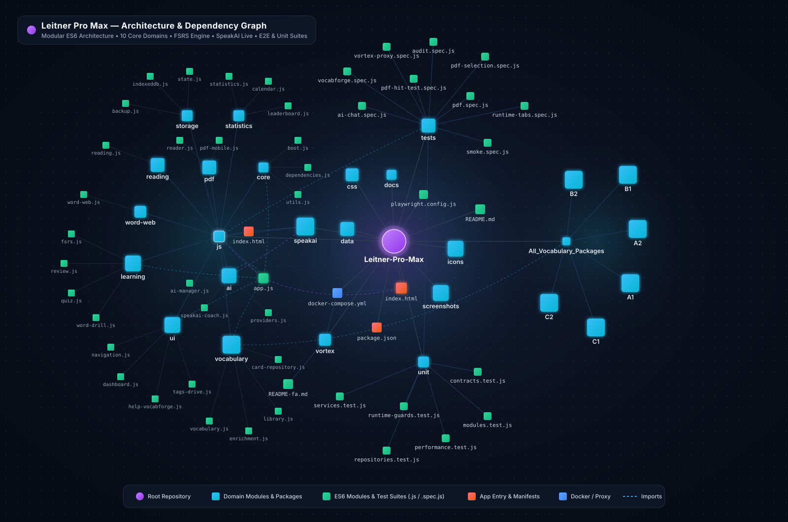

# 🚀 Leitner Pro Max — مرور هوشمند واژگان (Smart Flashcard Trainer)

<div align="center">

**نسخه ۵.۰ — یادگیری فاصله‌دار FSRS، مربی مکالمه صوتی (SpeakAI Coach)، مرور، آزمون، PDF Reader، AI Chat و VocabForge**


[🇮🇷 فارسی](#فارسی) · [🇬🇧 English](#english) · [🇩🇪 Deutsch](#deutsch) · [🇹🇷 Türkçe](#türkçe) · [🇷🇺 Русский](#русский)

**Live:** https://mohsen-niksirat.github.io/Leitner-Pro-Max/

<br/>



</div>

---

## فارسی

### ✨ قابلیت‌های اصلی
- **مرور هوشمند FSRS** — زمان‌بندی تطبیقی، فاصله تکرار، Again/Hard/Good/Easy
- **کتابخانه و حافظه بلندمدت** — دسته‌بندی، برچسب، جستجو، فیلتر، غنی‌سازی و ترجمه‌ی هر کلمه
- **آزمون** — چهارگزینه‌ای، املایی، جای‌خالی و Quiz اختصاصی زبان
- **PDF Reader** — خواننده‌ی دسکتاپ (canvas + text layer) و **PDF-Mobile** مخصوص گوشی
- **VocabForge** — استخراج کلمات از متن/PDF/TXT/DOCX، غنی‌سازی خودکار (تعریف/مترادف/مثال/تلفظ)، انتقال به کتابخانه یا حافظه بلندمدت، کش IndexedDB
- **چت با هوش مصنوعی (۲۰۲۶)** — Gemini 3.1 / 2.5، OpenRouter Free، Groq (Llama 3.3 / Qwen 3)، Pollinations (چند کلید + چرخش خودکار)
- **مربی مکالمه صوتی هوشمند (SpeakAI Coach)** — مکالمه زنده دوطرفه، تمرین شدویینگ (Shadowing Studio)، ۹ نقش آموزشی (ممتحن آیلتس، مصاحبه شغلی، مناظره و...) و انتقال یک‌کلیکی واژگان مکالمه به جعبه لایتنر
- **آمار و Heatmap** — XP، سطح، چرخه سنجش، نمودارها و پیش‌بینی
- **نقشه واژگان** — روابط معنایی بین کلمات
- **ورود/خروج CSV/JSON/Anki/PDF/TXT/DOCX** و پشتیبان‌گیری Google Drive
- **PWA/آفلاین** — Service Worker با پرکش کامل و ورود آفلاین
- **چندزبانه** — رابط کاربری فارسی با پشتیبانی از تم تاریک/روشن

### 🏗️ معماری ماژولار و گراف وابستگی‌ها (Architecture & Dependency Graph)
پروژه بر پایه **معماری ماژولار ES6** در ۱۰ دامنه مستقل زیر پوشه `js/` سازمان‌دهی شده است:
- **`js/core/`** — راه‌اندازی برنامه (`boot.js`)، مدیریت وابستگی‌ها (`dependencies.js`)، ابزارها (`utils.js`) و مدیریت خطا
- **`js/storage/`** — موتور ذخیره‌سازی `IndexedDB` (`indexeddb.js`)، مدیریت وضعیت (`state.js`) و پشتیبان‌گیری خودکار (`backup.js`)
- **`js/learning/`** — الگوریتم علمی تکرار فاصله‌دار **FSRS** (`fsrs.js`)، جلسه مرور (`review.js`)، آزمون‌ها (`quiz.js`) و تمرین کلمات (`word-drill.js`)
- **`js/vocabulary/`** — مخزن کارت‌ها (`card-repository.js`)، غنی‌سازی واژگان (`enrichment.js`)، کتابخانه (`library.js`) و بسته‌های سطح‌بندی‌شده CEFR (`A1` تا `C2`)
- **`js/ai/`** — مدیر چت هوش مصنوعی (`ai-manager.js`)، ارائه‌دهنده‌ها (`providers.js`) و پل ارتباطی مربی مکالمه (`speakai-coach.js`)
- **`js/pdf/` و `js/reading/`** — موتور خوانش PDF دسکتاپ/موبایل و بخش درک مطلب
- **`js/statistics/` و `js/word-web/`** — تحلیل آماری، تقویم حرارتی، لیدربورد و گراف معنایی واژگان
- **`js/ui/`** — ناوبری، داشبورد، تنظیمات، همگام‌سازی Google Drive و VocabForge
- **`tests/` و `tests/unit/`** — پوشش کامل تست‌های واحد و تست‌های سرتاسری (Playwright E2E)

### 🗂️ ذخیره‌سازی و Audit آفلاین
- IndexedDB (بدون محدودیت حجم) به‌عنوان منبع حقیقت؛ مهاجرت یک‌بار از localStorage قدیمی
- کش ترجمه/دیکشنری با `app_cache_*` در همان IndexedDB (با دکمه‌ی تخلیه در کتابخانه)

### 🚀 اجرا
```bash
python -m http.server 8000
```
سپس `http://localhost:8000/` را باز کنید (ES Modules و SW به HTTP نیاز دارند؛ `file://` معتبر نیست).

### 🧪 تست
```bash
npm install
npm test
```
تست‌های Playwright مسیر کامل وکب فورج، PDF ابزار mobile، مهاجرت و PWA آفلاین را پوشش می‌دهند.

### 🔗 مخازن مرتبط
- **مربی مکالمه صوتی (SpeakAI Coach):** https://github.com/mohsen-niksirat/SpeakAI-Coach
- **چت هوش مصنوعی کامل (Free AI Chat):** https://github.com/mohsen-niksirat/Free-AI-Chat

---

## 🇬🇧 English

### ✨ Key Features
- **FSRS smart review** — adaptive scheduling, lagged intervals, Again/Hard/Good/Easy
- **Library & Long-Term Memory** — categories, tags, search, filters, per-word enrich/translate
- **Quiz** — multiple-choice, spelling, fill-in-the-blank, language quiz
- **PDF** — desktop canvas reader + **PDF-Mobile** for phones
- **VocabForge** — extract words from text/PDF/TXT/DOCX, auto-enrich (dictionary/translation/examples), transfer to Library or Long-Term
- **AI Chat & SpeakAI Coach** — Gemini, OpenRouter, Groq, Pollinations (multi-key rotation) + integrated Real-Time AI Speaking & Shadowing Coach
- **Statistics** — accuracy, XP, level, heatmap, forecast, charts
- **Word Web** — semantic relationships
- **Import/Export** — CSV/JSON/Anki/PDF/TXT/DOCX, Google Drive backup
- **PWA/Offline** — Service Worker with full precache
- **Themes** — dark/light

### 🧩 Modular Architecture & Storage
Built on a clean 10-domain native ES6 module architecture (`core`, `storage`, `learning`, `vocabulary`, `ai`, `pdf`, `reading`, `statistics`, `word-web`, `ui`) orchestrated by `js/app.js`. IndexedDB is the source of truth; legacy `leitner_v2` migrates once. Lookup caches (`app_cache_*`) live in the same DB with a flush button.

### 🚀 Run
```
python -m http.server 8000
```
Open `http://localhost:8000/` (ES Modules & Service Worker need HTTP).

### 🧪 Tests
```
npm install
npm test
```
Playwright suites cover VocabForge full flow, PDF, mobile, migration & PWA offline.

### 🔗 Related Repositories
- **SpeakAI Coach (Real-Time Voice & Shadowing):** https://github.com/mohsen-niksirat/SpeakAI-Coach
- **Full AI Chat:** https://github.com/mohsen-niksirat/Free-AI-Chat

---

## 🇩🇪 Deutsch

### ✨ Hauptfunktionen
- **FSRS-Lernalgorithmus** — adaptive Zeitplanung, Intervalle, Again/Hard/Good/Easy
- **Bibliothek & Langzeitgedächtnis** — Suche, Filter, Tags, pro Wort anreichern & übersetzen
- **Quiz** — Multiple-Choice, Rechtschreibung, Lückentexte
- **PDF-Reader** — Desktop + Mobile-Variante
- **VocabForge** — Wörter aus Text/PDF/TXT/DOCX extrahieren und anreichern
- **AI-Chat** — Gemini, OpenRouter, Groq, Pollinations (mit Link zur Vollversion)
- **Statistik** — Heatmap, XP, Charts, Forecast
- **PWA** — Offline-fähig, vollständig precached

### 🚀 Ausführen
```
python -m http.server 8000
```
Dann `http://localhost:8000/` öffnen.

### 🔗 Vollständiger AI-Chat
https://github.com/mohsen-niksirat/Free-AI-Chat

---

## 🇹🇷 Türkçe

### ✨ Özellikler
- **FSRS akıllı tekrar** — uyarlanabilir zamanlama, tekrar aralıkları
- **Kütüphane ve uzun süreli hafıza** — arama, filtre, etiketler, her kelime için zenginleştirme/çeviri
- **Sınav** — çoktan seçmeli, yazım, boşluk doldurma
- **PDF okuyucu** — masaüstü ve mobil
- **VocabForge** — metin/PDF/TXT/DOCX'ten kelime çıkar, zenginleştir, aktar
- **Yapay zekâ sohbeti** — Gemini, OpenRouter, Groq, Pollinations
- **İstatistik** — ısı haritası, XP, grafikler
- **PWA** — çevrimdışı çalışır

### 🚀 Çalıştırma
```
python -m http.server 8000
```
Sonra `http://localhost:8000/` açın.

### 🔗 Tam AI Sohbeti
https://github.com/mohsen-niksirat/Free-AI-Chat

---

## 🇷🇺 Русский

### ✨ Основные возможности
- **FSRS-интервалы** — адаптивное планирование повторений
- **Библиотека и долговременная память** — поиск, фильтры, теги, обогащение каждого слова
- **Тесты** — выбор ответа, правописание, вопросы с пропусками
- **PDF-читка** — десктопная и мобильная версии
- **VocabForge** — извлечение слов из текста и файлов, автodополнение, перенос во коллекции
- **AI-чат** — Gemini, OpenRouter, Groq, Pollinations
- **Статистика** — тепловая карта, XP, графики
- **PWA** — установка и работа офлайн

### 🚀 Запуск
```
python -m http.server 8000
```
Откройте `http://localhost:8000/`.

### 🔗 Полный AI-чат
https://github.com/mohsen-niksirat/Free-AI-Chat

---

## 📄 License
MIT
